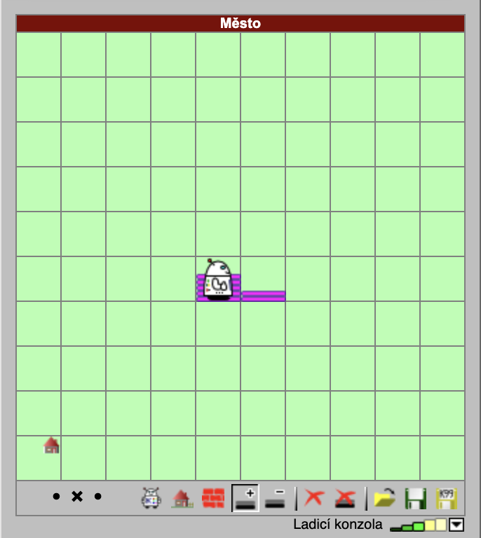
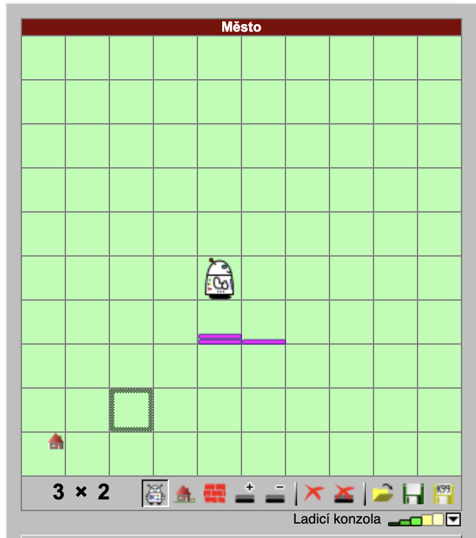

# Problem-solving part

This part will be the most difficult one since we expect this will probably be new for you.
Indeed, that is intended to evaluate how you can make yourself comfortable in something you have not seen before.

## What is needed
You will be solving three simple tasks in the Karel the Robot language. You can find the "IDE" here:
https://karel.oldium.net/, along with the documentation here: https://karel.oldium.net/napoveda.html. Karel is a happy little robot moving through his city. He can drop and collect marks.
We can program Karel using straightforward language, which was originally designed for kids. To make things simple (and more challenging simultaneously), we won't use the full language, but we will restrict ourselves only to a small subset. The subset will be:
- `KROK`
- `VLEVO-VBOK`
- `POLOŽ`
- `ZVEDNI`
- conditioning on marks:
```
 KDYŽ JE ZNAČKA
 (your code)
 KONEC, JINAK
 (else)
 KONEC
```
- and declaring procedures:
```
 YOUR-SHINY-PROCEDURE
 (your code)
 KONEC
```

Most importantly, be aware that we have no explicit cycles and variables. Solving this will be your biggest challenge, however consider, that all of this listed below is completely possible.

## Tasks
1. `MOVE-MARKS`: Move all of the marks from Karel's tile one step forward. You don't have to check for enough space on the resulting tile (the maximum number of marks per tile is 8).

__Example:__


2. `MOVE-MARKS-AT-ONCE`: Again, move all of the marks from Karel's tile one step forward. This time, you are allowed only one `KROK` command in the whole program.

__Example:__


3. `DIVIDE-WITH-REMAINDER`: Karel starts in configuration, where there are X marks on his tile and Y marks on the tile directly in front of him, e.g.:
```
>X Y
```
The program should end in the state where:
```
 X           Y
(X div Y)   (X mod Y)
```
Where `div` is the integer division and `mod` is the remainder. We do not require that `X` and `Y` be intact, nor do we care about Karel's position. Keep in mind that this is a challenging problem. If you cannot complete division with remainder, you can implement simple division instead. You don't have to solve the case where `Y == 0`, but `X == 0` or `X < Y` still can happen.

__Example:__



## What to focus on
- Decomposition
- Being able to tell what is going on
- Correctness

## What not to focus on
- I don't know, honestly :D. Maybe not getting too angry at little Karel?

## What to commit?
All of the code. The web IDE is quite old, so I recommend writing the code to a text file and then copying it to test and debug.